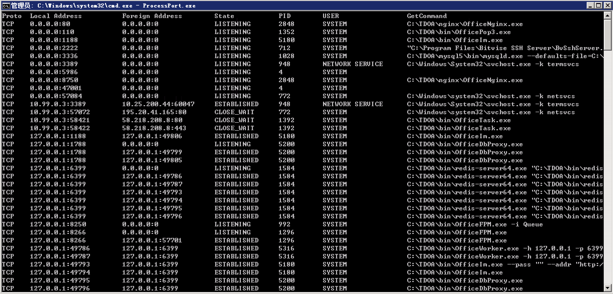

# SharpNetstat

netstat 本来功能就足够强大, 主要还需要通过 wmi 获取pid 的具体信息, 所以有了 c#版本的产物

- monitor指令支持进程实时刷新
- listen 指令用于查看系统监听的信息
- 师傅们测试出现问题欢迎提issues


```
C:\Users\Administrator\Desktop>SharpNetstat.exe -h

Author: Evi1oX

Usage: SharpNetStat -s listen
       SharpNetStat -s monitor
       SharpNetStat -s monitor listen
```




